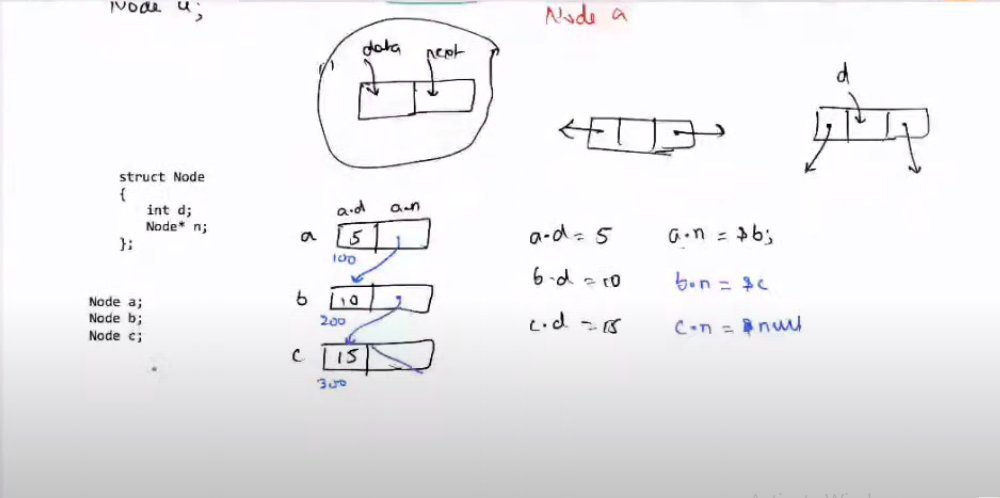

## Topic - Linked List

#### Structure of a Node

```
struct Node{
    int d;
    Node *n;
};
```

- Concept of Node is common in all dynamic data structures



- Basic LinkedList functions

```
public class Main
{
    static class Node{
        int data;
        Node next;
        // CONSTRUCTOR
        Node(int val){
            data = val;
            next = null;
        }
    }
    // 5 -> 10 -> 15 -> 20 -> null
    public static Node createSampleList(){
        Node h = new Node(5);
        h.next = new Node(10);
        h.next.next = new Node(15);
        h.next.next.next = new Node(20);
        
        return h;
    }
    // Print the LinkedList
    public static void printList(Node head){
        while(head != null){
            System.out.println(head.data);
            head = head.next;
		}
    }
    // Print the LinkedList using recursion 
    public static void printListwithRecursion(Node h){
        if(h == null) return;
        System.out.println(h.data);
        printListwithRecursion(h.next);
    }
    // Print the LinkedList in reverse order
    public static void printReverseList(Node h){
        if(h == null) return;
        printReverseList(h.next);
        System.out.println(h.data);
    }

    // Reverse the LinkedList - T.C -> O(n) , S.C -> O(1)
    public static void Reverse(Node h){
        Node newH = null;
        
        while(h != null){
            Node temp = h;
            h = h.next;
            
            temp.next = newH;
            newH = temp;
        }
    }

	public static void main(String[] args) {
		Node head = createSampleList();
		printList(head);
		printListwithRecursion(head);
		printReverseList(head);
	}
}

```

### More Problems Discussed 

* Check if linked list is palindrome - Divide the linked list from middle and then reverse the latter half, and check if two linked list formed are same or not

* Leave M nodes as it is and then reverse next N nodes and continue
    * Example - 1 2 3 4 5 6 7 8 9
                1 2     3 4 5   6 7     8 9
        Ans - > 1 2     5 4 3   6 7     9 8

* Add two numbers given in form of linked list 
    * Example - 4956
            +    547
            --------
                5503
    Given, h1 -> 4 -> 9 -> 5 -> 6
    Given, h2 -> 5 -> 4 -> 7

        return h3 -> 5 -> 5 -> 0 -> 3
```
Node add(Node h1, Node h2){
    h1 = reverse(h1);
    h2 = reverse(h2);
    Node originH1 = h1;
    Node originH2 = h2;
    int c = 0;
    Node h3 = null;

    while(h1 != null || h2 != null){
        int sum = c;
        if(h1 != null){
            sum += h1.data;
        }
        if(h2 != null){
            sum += h2.data;
        }
        // We can reverse the h3 linked list later if we add elements at last, or we can add elements at front

        Node temp = new Node(sum%10);
        temp.next = h3;
        h3 = temp;
        c = sum/10;
    }
    if(c != 0){
        Node temp = new Node(c);
        temp.next = h3;
        h3 = temp;
    }

    h1 = reverse(originH1);
    h2 = reverse(originH2);

    return h3;
}
```

### Quiz

1. Given LinkedList 5 -> 10 -> 15 -> 20

    ```
    public static void printList(Node h){
        if(h == null) return;

        System.out.print(h.data + " ");
        printList(h.next);
        System.out.print(h.data + " ");
    }
    ```

    Ans -> 5 10 15 20 20 15 10 5

2. What should be the return type of this function 
    ```
    insertAtNode(Node h, int val){

    }
    ```

    Ans -> Node

3. Given LinkedList 1 -> 2 -> 3 -> 4 -> 5 -> 6 -> 7 -> 8
    ```
    void fun(Node h, int num){
        if(h == null) return 0;

        if(num%3 == 0) 
            System.out.println(h.data);
        
        fun(h.next, num+1);
    }
    ```

    Function called as fun(h, 1);

    Output ->   3 
                6