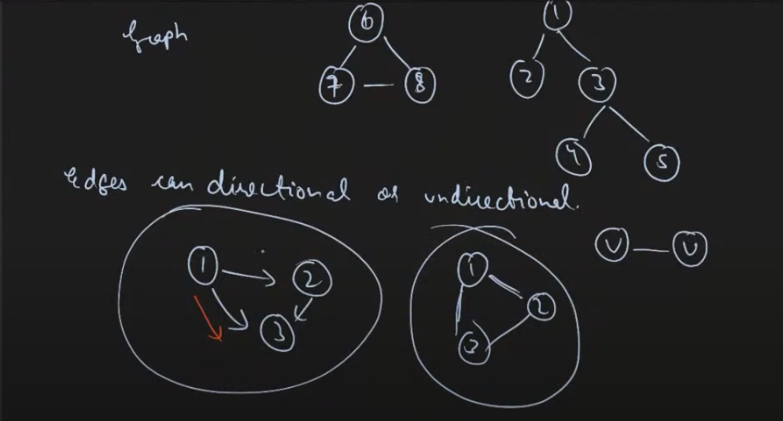
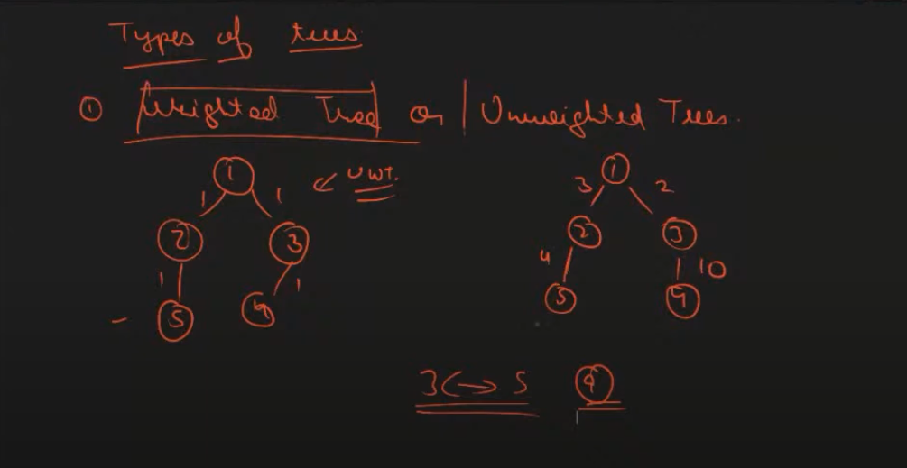
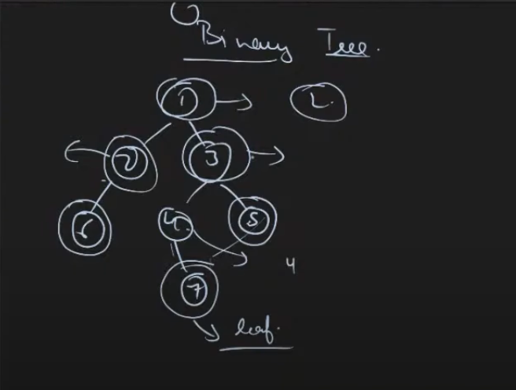
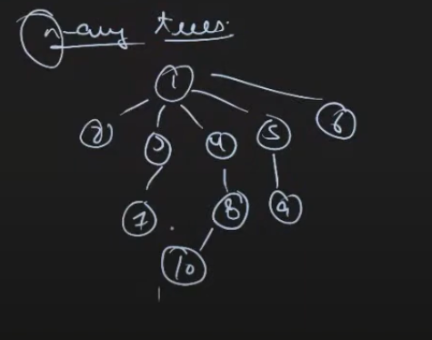

## Mentor's LinkedIn - https://www.linkedin.com/in/apaarkamal/

## Topic - Trees in Data Structure

#### Graphs

- Consists of Nodes and edges

* Directed
* Undirected 

#### Trees

- Connected Graph with no cycles
    * Connected Graph -> In which every pair of node has atleast one path between them
    * Cycles -> If we start from a vertex u then if we can come back to u without repeating any edge, then cycle is formed
- Number of edges (m) = number of nodes (n) - 1
- If it is a connected graph with (n-1) edges then it is a tree

##### Some Terms related to trees

* root -> The top most node in the tree
* parent -> The node, which is one level above the node, and is directly connected to the given node is called parent of the given node
* child -> The node, which is one level below the node, and is directly connected to the given node is called parent of the given node
* ancestors -> all the nodes that lie on the path from given node to root are ancestors

##### Types of trees

- On the basis of weight -> Weighted and unweighted

- On the Basis of Number of childs
    * Binary tree -> Each node has atmost 2 childrens (0 / 1 / 2)
    
    * n-ary tree
    

##### BFS and DFS
    - most important concepts in tree and Graphs

    - BFS can also be used to calculate distances to every other node from a source node

##### Problems

1. Given a tree, and two nodes x and y. Print path from x to y
    - Make x as root node, do a dfs and store parents of each node and then climb from y to root by moving to parent node each time