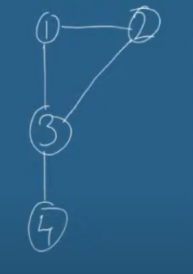
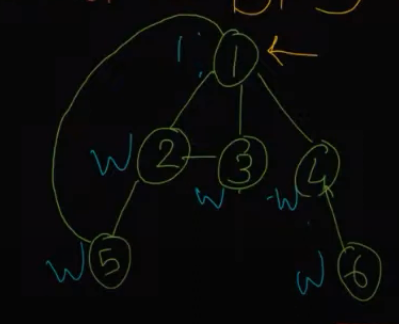
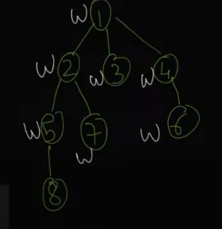

## Mentor's LinkedIn - https://www.linkedin.com/in/aanshul-sadaria-31069494/

## Topic - Graphs (Part-1)

### Types of Graphs
    - Directed and Undirected
        * undirected - there is a path between 2 cities, which connects both cities from both sides
            - Maximum degree of any vertex is |V| - 1, where |V| is the total number of vertices and minimum is zero
        * directed - You follow someone on instagram, but they don't follow you back, this is directed
            - In this, two types of degrees are possible, In degree and Out degree

    - Weighted and unweighted graphs
        * Weights tell how strong is the relation between two vertices, for example weight may depict the distance between two places.

### Graph Representation


1. Adjacency Matrix 
    
    A square matrix with number of rows and colums equal to number of vertices
    ```
    For unweighted graph
    M[i][j] = 1     if Vi is connected to Vj
    else M[i][j] = 0
    ```

    ```
    For weighted graph
    M[i][j] = W     if Vi is connected to Vj with weight W
    else M[i][j] = infinity
    ```

    For above graph

         1   2   3   4
         --------------
    1  | 0   1   1   0
    2  | 1   0   1   0
    3  | 1   1   0   1
    4  | 0   0   1   0

    Space Complexity - O(V^2)

    Advantage - easily update, can be scaled using parallel processing, easily find if a node 'u' is connected to other node 'v'

    Disadvantages - Generally, In real world graphs are sparse, so majority of values in matrix are wasted

2. Adjacency List

    Space Complexity - O(v+e)

    For above graph:

    1 -> [2, 3]
    2 -> [1, 3]
    3 -> [1, 2, 4]
    4 -> [3 ]

    Advantage - Saves memory
    Disadvantage - Not very easy to update the graph


#### Graph Traversal Algorithms

1. Breadth First Search (BFS)
2. Depth First Search (DFS)

- BFS
    3 colors - White(undiscovered), Grey(discovered), Balck(visited)

    Uses a queue, 
    Assume all nodes as white
    Put starting node in queue
    pop from the front of queue
        push adjacent nodes of popped node in queue, which are white
    repeat till queue is not empty

    Example - 
    

    Output ->  1 2 3 4 5 6

    ##### pseudo code
    ```
    vector<int> v;
    queue<int> q;
    vector<vector<int>> adj;
    color[] = {0};      // white -> 0, grey -> 1, black -> 2
    color[v[0]] = 1;   // starting from node 0
    q.push(v[0]);

    while(!q.isEmpty()){
        int u = q.pop();
        color[u] = 2;
        // iterate over adjacency list of u
        for(auto node: adj[u]){         // node is adjacent node of u
            if(color[node] == 0){
                q.push(node);
                color[node] = 1;
            }
        }
    }
    ```
    Time Complexity - O(2V + 2E) => O(V+E)
    Space Complexity - O(V)

- DFS
    similar 3 colors concept
    Graph - 

    Time Complexity - O(2V + 2E) => O(V+E)
    Space Complexity - O(V) , use of inbuilt call stack

    ```
    dfs(1);  // start from 1

    dfs(node x){
        color[x] = grey;
        iterate adj[x]{
            if(color[adj[x][i]] == white){
                dfs(adj[x][i]) // move forward
            }
        }
        color[adj[x]] = black;
        return; // backtrack 
    }
    ```